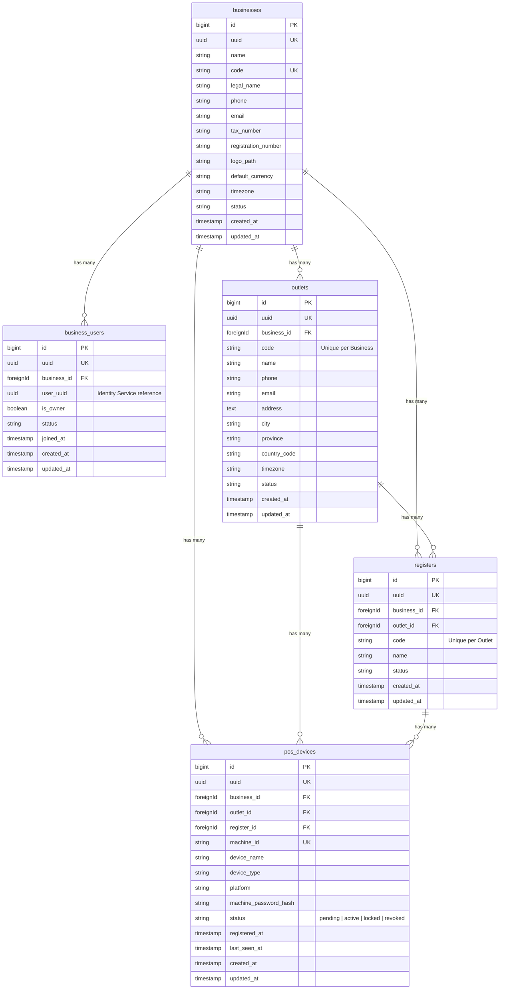

# SmartPOS Business Service :8002

Independent Laravel microservice responsible for managing business entities, membership, multi-tenant outlets, cash registers, and POS hardware devices for the SmartPOS ecosystem.

---

## 🏢 Domain Architecture & Overview

```text
smartpos-business-service :8002
│
├── 🏢 Businesses (Tenant Master)
├── 👥 Business Users (Identity Reference Membership)
├── 🏪 Outlets (Locations)
├── 🖨️ Registers (Cash Drawers / Points of Sale)
└── 📱 POS Devices (Hardware Terminal Security)
```

> **Identity Integration Principle**: Identity information remains strictly inside `identity-service`. `business-service` only keeps references (`user_uuid`) with no cross-database foreign keys.

---

## 🚀 Technical Stack & Services

- **Framework**: Laravel 13 (PHP 8.3)
- **Database**: MySQL 8.4 (`smartpos-business-mysql` on port `3308`)
- **Cache & Queue**: Redis (`smartpos-business-redis` on port `6381`)
- **Database GUI**: phpMyAdmin (`smartpos-business-phpmyadmin` on port `8082`)
- **API Documentation**: Scramble (`http://localhost:8002/docs/api`)
- **API Gateway Routing**: Proxied via `api-gateway` on port `80` (`http://api.smartpos.test/api/v1/businesses/...`)

---

## 📊 Database Schema



---

## 🔐 Security & Middlewares

### 1. JWT Authentication (`jwt.auth`)
Verifies Bearer tokens generated by `identity-service` using HMAC-SHA256 signature check (`JWT_SECRET`). Extracts `user_uuid`, `roles`, and `permissions` without HTTP round-trips.

### 2. Business Membership Guard (`business.member`)
Ensures the authenticated `user_uuid` is an active member of the target business. Returns `403 Forbidden` for cross-tenant access.

### 3. Business Owner Guard (`business.owner`)
Protects owner-level actions (updating business details, adding/removing members, suspending users). Prevents accidental removal of the sole business owner.

### 4. Outlet Access Guard (`outlet.access`)
Verifies that the target outlet belongs to a business where the authenticated user holds active membership.

### 5. POS Hardware Security (`pos-devices/auth`)
- **Registration**: Generating machine credentials produces a random 32-character machine password, returned **only once** in response. The password hash is stored in `pos_devices`.
- **Status Lifecycle**: `pending` ➔ `active` ➔ `locked` ➔ `revoked`.
- **Authentication**: Devices authenticate via `machine_id` and `machine_password`, updating `last_seen_at` and returning full terminal context (POS Device, Business, Outlet, Register).

---

## 📡 API Endpoint Reference

All endpoints accept standard headers:
```http
Authorization: Bearer {identity_access_token}
Accept: application/json
```

### Health Check
- `GET /api/v1/business/health` — Public health check.

### Businesses API
- `GET /api/v1/businesses` — List user's active businesses (`businesses.view`)
- `POST /api/v1/businesses` — Create business (Assigns creator as Owner) (`businesses.create`)
- `GET /api/v1/businesses/{business}` — Show business details (`businesses.view`, `business.member`)
- `PUT /api/v1/businesses/{business}` — Update business details (`businesses.update`, `business.owner`)
- `DELETE /api/v1/businesses/{business}` — Delete business (`businesses.delete`, `business.owner`)

### Business Users API
- `GET /api/v1/businesses/{business}/users` — List members (`business_users.view`, `business.member`)
- `POST /api/v1/businesses/{business}/users` — Add user to business (`business_users.manage`, `business.owner`)
- `PUT /api/v1/businesses/{business}/users/{user}` — Update member role (`business_users.manage`, `business.owner`)
- `POST /api/v1/businesses/{business}/users/{user}/suspend` — Suspend member (`business_users.manage`, `business.owner`)
- `DELETE /api/v1/businesses/{business}/users/{user}` — Remove member (`business_users.manage`, `business.owner`)

### Outlets API
- `GET /api/v1/businesses/{business}/outlets` — List outlets (`outlets.view`, `business.member`)
- `POST /api/v1/businesses/{business}/outlets` — Create outlet (`outlets.create`, `business.member`)
- `GET /api/v1/outlets/{outlet}` — Show outlet details (`outlets.view`, `outlet.access`)
- `PUT /api/v1/outlets/{outlet}` — Update outlet (`outlets.update`, `outlet.access`)
- `DELETE /api/v1/outlets/{outlet}` — Delete outlet (`outlets.delete`, `outlet.access`)

### Registers API
- `GET /api/v1/outlets/{outlet}/registers` — List registers (`registers.view`, `outlet.access`)
- `POST /api/v1/outlets/{outlet}/registers` — Create register (`registers.create`, `outlet.access`)
- `GET /api/v1/registers/{register}` — Show register (`registers.view`)
- `PUT /api/v1/registers/{register}` — Update register (`registers.update`)
- `DELETE /api/v1/registers/{register}` — Delete register (`registers.manage`)

### POS Devices API
- `GET /api/v1/outlets/{outlet}/pos-devices` — List POS devices (`pos_devices.view`, `outlet.access`)
- `POST /api/v1/outlets/{outlet}/pos-devices` — Register POS device & generate password (`pos_devices.create`, `outlet.access`)
- `GET /api/v1/pos-devices/{posDevice}` — Show POS device details (`pos_devices.view`)
- `PUT /api/v1/pos-devices/{posDevice}` — Update POS device (`pos_devices.update`)
- `POST /api/v1/pos-devices/{posDevice}/activate` — Activate device (`pos_devices.manage`)
- `POST /api/v1/pos-devices/{posDevice}/lock` — Lock device (`pos_devices.manage`)
- `POST /api/v1/pos-devices/{posDevice}/revoke` — Revoke device access (`pos_devices.manage`)
- `POST /api/v1/pos-devices/auth` — Machine authentication using `machine_id` & `machine_password` (Public device route)

---

## 🛠️ Local Development & Testing

### Docker Commands

Start containers:
```bash
docker compose up -d --build business-service
```

Check status:
```bash
docker compose ps
```

Expected status:
```text
NAME                             SERVICE               STATUS
smartpos-business-service-1      business-service      Up
smartpos-business-mysql-1        business-mysql        Up (healthy)
smartpos-business-redis-1        business-redis        Up (healthy)
smartpos-business-phpmyadmin-1   business-phpmyadmin   Up
```

### Running Database Migrations

```bash
docker compose exec business-service php artisan migrate
```

### Running Automated Test Suite

Run unit and feature tests:
```bash
docker compose exec business-service php artisan test
```

Expected Output:
```text
  Tests:    20 passed (54 assertions)
  Duration: 0.29s
```

---

## 📚 Interactive API Documentation

Interactive OpenAPI documentation is powered by Scramble:
- Local URL: `http://localhost:8002/docs/api`
- Via API Gateway: `http://api.smartpos.test/docs/business`
