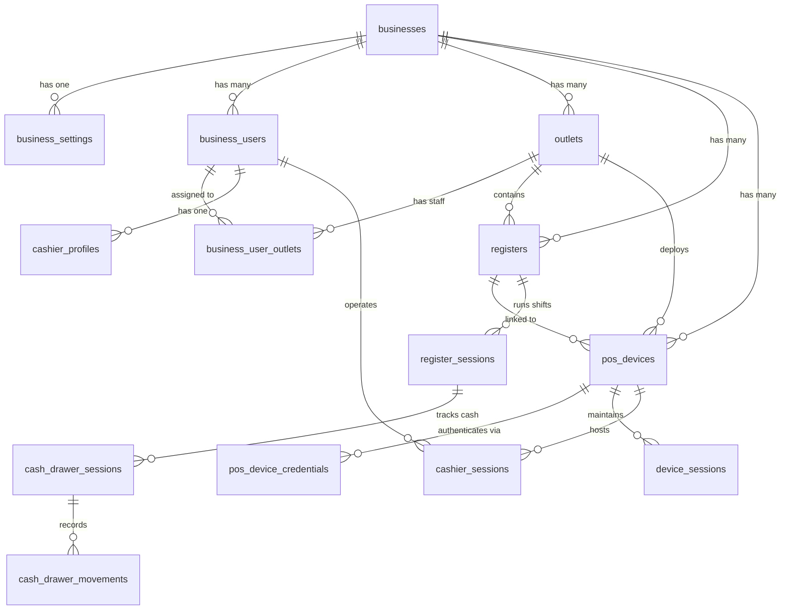

# SmartPOS Business Service :8002

[](https://github.com/kheangsenghorng/smartpos_business-service/actions/workflows/ci.yml)
[](https://github.com/kheangsenghorng/smartpos_business-service)
[](https://www.php.net)
[](https://laravel.com)
[](LICENSE)

Independent Laravel microservice responsible for managing business multi-tenancy, staff assignments, store locations (outlets), cash registers, POS hardware terminal credentials, cashier shift sessions, and cash drawer balance reconciliation in the SmartPOS ecosystem.

---

## 🏢 Domain Architecture & Overview

```text
smartpos-business-service :8002
│
├── 🏢 Businesses (Tenant Master & Business Settings)
│   ├── ⚙️ Business Settings (Taxation, Receipt, Currency, Security)
│   └── 👥 Business Users (Identity Reference Membership & Outlet Assignment)
│       └── 👤 Cashier Profiles (Display Name, Passcode PIN Hash)
│
├── 🏪 Outlets (Physical Store Locations)
│   ├── 🖨️ Registers (Points of Sale / Physical Counters)
│   │   ├── 📋 Register Sessions (Open/Close Shifts, Float, Cash Count)
│   │   └── 💵 Cash Drawer Sessions & Movements (Cash In/Out, Payout, Safe Drops)
│   │
│   └── 📱 POS Devices (Hardware Terminals)
│       ├── 🔑 Machine Credentials (Machine ID + Scrambled Password Hash)
│       ├── 🔄 Device Sessions (Terminal Heartbeat & Active Token Lifecycle)
│       └── 🧑‍💼 Cashier Sessions (Cashier Login, Screen Lock, PIN Unlock)
```

> **Identity Integration Principle**: Identity accounts, passwords, and global tokens reside exclusively in `identity-service`. `business-service` stores cross-service identity references (`user_uuid`) with zero foreign keys across microservice boundaries.

---

## 🚀 Technical Stack & Infrastructure

- **Framework**: Laravel 13 (PHP 8.4)
- **Database**: MySQL 8.4 (`smartpos-business-mysql` on port `3308`)
- **Cache & Key-Value Store**: Redis (`smartpos-business-redis` on port `6381`)
- **Database GUI**: phpMyAdmin (`smartpos-business-phpmyadmin` on port `8082`)
- **Interactive Documentation**: Scramble (`http://localhost:8002/docs/business`)
- **API Gateway Routing**: Proxied via Nginx Gateway on port `80` (`http://api.smartpos.test/api/v1/...`)

---

## 📊 Database Entity Relationship Model



### Table Schema Summary (14 Core Tables)

| Table Name | Purpose | Key Constraints |
|---|---|---|
| `businesses` | Master tenant record, legal entity info, currencies | `uuid` (UK), `code` (UK) |
| `business_settings` | Customization: tax, receipt footer, auto-lock | `business_id` (FK, UK) |
| `business_users` | Tenant membership & owner flag | `(business_id, user_uuid)` (UK) |
| `business_user_outlets` | Staff outlet access & role assignments | `(business_user_id, outlet_id)` (UK) |
| `cashier_profiles` | Cashier nickname, PIN code hash, fast-switch preferences | `business_user_id` (FK, UK) |
| `outlets` | Store branches, timezone, operating address | `(business_id, code)` (UK) |
| `registers` | Cash drawer counters / workstations | `(outlet_id, code)` (UK) |
| `pos_devices` | Hardware terminals (Android, iPad, Desktop POS) | `machine_id` (UK), `status` |
| `pos_device_credentials` | Terminal auth credentials & generated tokens | `pos_device_id` (FK), `token` (UK) |
| `device_sessions` | Terminal heartbeat & active session lifecycle | `device_token` (UK), `last_heartbeat_at` |
| `cashier_sessions` | Cashier shift login, screen lock & PIN unlock | `(outlet_id, user_uuid, status)` |
| `register_sessions` | Register opening float, shift duration, counted cash | `register_id` (FK), `status` |
| `cash_drawer_sessions` | Real-time cash balance tracking & drawer status | `register_session_id` (FK, UK) |
| `cash_drawer_movements` | Immutable audit log of every cash in/out/refund | `cash_drawer_session_id` (FK), `type` |

---

## 🔐 Security Architecture & Hardening

### 1. Stateless JWT Authentication (`jwt.auth`)
- Validates HMAC-SHA256 tokens issued by `identity-service`.
- Extracts `user_uuid`, `roles`, and `permissions` claim payload directly without remote HTTP calls.
- Strict requirement of `JWT_SECRET` from environment with zero hardcoded defaults.

### 2. Multi-Tenant Authorization Guards
- `business.member`: Blocks cross-tenant data leaks by ensuring the authenticated user belongs to the target business.
- `business.owner`: Guards destructive owner-only actions (settings updates, adding/suspending staff).
- `outlet.access`: Enforces that the target store location belongs to the user's active business.
- `register.access`: Verifies that the cash register is bound to the target outlet.
- `cashier.session.active`: Ensures POS operations can only proceed if an active (unlocked) cashier session exists on the terminal.

### 3. Attack Shield & Input Sanitization
- `AttackShieldMiddleware`: Inspects request payloads and URIs to block SQL injection patterns, web vulnerability scanners (sqlmap, Nikto, Acunetix), path traversal (`../`), and command injection probes.
- `SanitizeInputMiddleware`: Strips dangerous tags and HTML entities from user input strings while preserving numeric/JSON payloads.
- `SecurityHeadersMiddleware`: Sets `Content-Security-Policy`, `X-Content-Type-Options: nosniff`, `X-Frame-Options: DENY`, `Strict-Transport-Security`, and `Referrer-Policy`.

### 4. Tiered Rate Limiting Protection

| Limiter | Limit | Applied To | Defense Purpose |
|---|---|---|---|
| `api` | 60 req/min | All authenticated API routes | Prevents resource starvation and API abuse |
| `auth` | 5 req/min | `POST /api/v1/pos-devices/auth` | Machine credential brute-force protection |
| `mutations` | 30 req/min | High-impact write routes | Throttles rapid destructive modifications |
| `cashier_pin` | 5 req/min | `POST .../cashier-sessions/{session}/unlock` | Prevents 4-digit cashier PIN guessing attacks |

### 5. High-Concurrency Pessimistic Row Locking
- `CashDrawerController::recordMovement()` and `RegisterSessionController::close()` execute inside database transactions utilizing **`lockForUpdate()`** on the `CashDrawerSession` and `RegisterSession` rows.
- Eliminates race conditions and balance calculation drift during concurrent transactions, refunds, and cash drops.

---

## 📡 API Endpoint Reference

All authenticated endpoints require standard headers:
```http
Authorization: Bearer {identity_access_token}
Accept: application/json
```

### 1. Health & Status
| Method | Endpoint | Description | Auth / Middleware |
|---|---|---|---|
| `GET` | `/api/v1/business/health` | Public microservice health check | Public |

### 2. Businesses & Settings
| Method | Endpoint | Description | Permission / Guard |
|---|---|---|---|
| `GET` | `/api/v1/businesses` | List authenticated user's businesses | `businesses.view` |
| `POST` | `/api/v1/businesses` | Create business (Assigns creator as Owner) | `businesses.create` |
| `GET` | `/api/v1/businesses/{business}` | Get single business details | `businesses.view`, `business.member` |
| `PUT` | `/api/v1/businesses/{business}` | Update business details | `businesses.update`, `business.owner` |
| `DELETE` | `/api/v1/businesses/{business}` | Delete business | `businesses.delete`, `business.owner` |
| `GET` | `/api/v1/businesses/{business}/settings` | Get business preferences & configuration | `businesses.view`, `business.member` |
| `PUT` | `/api/v1/businesses/{business}/settings` | Update business settings (tax, receipts, etc.)| `businesses.update`, `business.owner` |

### 3. Business Users & Staff Outlet Assignments
| Method | Endpoint | Description | Permission / Guard |
|---|---|---|---|
| `GET` | `/api/v1/businesses/{business}/users` | List business staff members | `business_users.view`, `business.member` |
| `POST` | `/api/v1/businesses/{business}/users` | Add staff member to business | `business_users.manage`, `business.owner` |
| `PUT` | `/api/v1/businesses/{business}/users/{user}` | Update member role/owner status | `business_users.manage`, `business.owner` |
| `POST` | `/api/v1/businesses/{business}/users/{user}/suspend` | Suspend staff member | `business_users.manage`, `business.owner` |
| `DELETE` | `/api/v1/businesses/{business}/users/{user}` | Remove staff member from business | `business_users.manage`, `business.owner` |
| `GET` | `/api/v1/businesses/{business}/users/{user}/outlets` | List assigned outlets for staff member | `business_users.view`, `business.member` |
| `POST` | `/api/v1/businesses/{business}/users/{user}/outlets` | Assign staff member to outlet | `business_users.manage`, `business.owner` |
| `DELETE` | `/api/v1/businesses/{business}/users/{user}/outlets/{outlet}` | Revoke staff outlet assignment | `business_users.manage`, `business.owner` |

### 4. Cashier Profiles & Security PIN
| Method | Endpoint | Description | Permission / Guard |
|---|---|---|---|
| `GET` | `/api/v1/businesses/{business}/users/{user}/cashier-profile` | Get cashier nickname & status | `business_users.view`, `business.member` |
| `PUT` | `/api/v1/businesses/{business}/users/{user}/cashier-profile` | Create/update cashier nickname & 4-digit PIN | `business_users.manage`, `business.owner` |

### 5. Outlets & Locations
| Method | Endpoint | Description | Permission / Guard |
|---|---|---|---|
| `GET` | `/api/v1/businesses/{business}/outlets` | List outlets in business | `outlets.view`, `business.member` |
| `POST` | `/api/v1/businesses/{business}/outlets` | Create new outlet | `outlets.create`, `business.member` |
| `GET` | `/api/v1/outlets/{outlet}` | Show outlet details | `outlets.view`, `outlet.access` |
| `PUT` | `/api/v1/outlets/{outlet}` | Update outlet details | `outlets.update`, `outlet.access` |
| `DELETE` | `/api/v1/outlets/{outlet}` | Delete outlet | `outlets.delete`, `outlet.access` |

### 6. Cash Registers
| Method | Endpoint | Description | Permission / Guard |
|---|---|---|---|
| `GET` | `/api/v1/outlets/{outlet}/registers` | List cash registers in outlet | `registers.view`, `outlet.access` |
| `POST` | `/api/v1/outlets/{outlet}/registers` | Create cash register | `registers.create`, `outlet.access` |
| `GET` | `/api/v1/registers/{register}` | Show cash register details | `registers.view` |
| `PUT` | `/api/v1/registers/{register}` | Update register details | `registers.update` |
| `DELETE` | `/api/v1/registers/{register}` | Delete cash register | `registers.manage` |

### 7. POS Hardware Devices & Terminal Authentication
| Method | Endpoint | Description | Permission / Guard |
|---|---|---|---|
| `POST` | `/api/v1/pos-devices/auth` | Machine authentication (`machine_id` + `password`) | `throttle:auth` (5/min) |
| `GET` | `/api/v1/outlets/{outlet}/pos-devices` | List registered POS devices | `pos_devices.view`, `outlet.access` |
| `POST` | `/api/v1/outlets/{outlet}/pos-devices` | Register device & generate machine password | `pos_devices.create`, `outlet.access` |
| `GET` | `/api/v1/pos-devices/{posDevice}` | Show POS device details | `pos_devices.view` |
| `PUT` | `/api/v1/pos-devices/{posDevice}` | Update device information | `pos_devices.update` |
| `POST` | `/api/v1/pos-devices/{posDevice}/activate` | Activate pending/locked device | `pos_devices.manage` |
| `POST` | `/api/v1/pos-devices/{posDevice}/lock` | Temporarily lock hardware device | `pos_devices.manage` |
| `POST` | `/api/v1/pos-devices/{posDevice}/revoke` | Permanently revoke device credentials | `pos_devices.manage` |

### 8. Device Sessions & Terminal Heartbeats
| Method | Endpoint | Description | Permission / Guard |
|---|---|---|---|
| `POST` | `/api/v1/pos-devices/{posDevice}/sessions/start` | Start hardware device session | `pos_devices.use` |
| `POST` | `/api/v1/pos-devices/{posDevice}/sessions/heartbeat` | Send terminal heartbeat (`online` / `battery`) | `pos_devices.use` |
| `POST` | `/api/v1/pos-devices/{posDevice}/sessions/end` | Terminate device session | `pos_devices.use` |

### 9. Cashier Sessions (Shift Login / Lock / PIN Unlock)
| Method | Endpoint | Description | Permission / Guard |
|---|---|---|---|
| `POST` | `/api/v1/outlets/{outlet}/cashier-sessions/start` | Start cashier session on register | `pos_devices.use`, `outlet.access` |
| `GET` | `/api/v1/outlets/{outlet}/cashier-sessions/current` | Get active cashier session | `pos_devices.use`, `outlet.access` |
| `POST` | `/api/v1/outlets/{outlet}/cashier-sessions/{session}/lock` | Lock terminal screen | `pos_devices.use`, `outlet.access` |
| `POST` | `/api/v1/outlets/{outlet}/cashier-sessions/{session}/unlock` | Unlock screen via 4-digit PIN | `pos_devices.use`, `throttle:cashier_pin` |
| `POST` | `/api/v1/outlets/{outlet}/cashier-sessions/{session}/end` | End cashier session | `pos_devices.use`, `outlet.access` |

### 10. Register Shift Management & Cash Drawer Reconciliation
| Method | Endpoint | Description | Permission / Guard |
|---|---|---|---|
| `GET` | `/api/v1/outlets/{outlet}/registers/{register}/shifts` | List historical shifts for register | `registers.view`, `outlet.access` |
| `GET` | `/api/v1/outlets/{outlet}/registers/{register}/shifts/current`| Get active open shift & drawer details | `registers.view`, `outlet.access` |
| `POST` | `/api/v1/outlets/{outlet}/registers/{register}/shifts/open` | Open register shift & set opening float | `registers.manage`, `outlet.access` |
| `POST` | `/api/v1/outlets/{outlet}/registers/{register}/shifts/{shift}/close`| Close shift & reconcile counted cash | `registers.manage`, `outlet.access` |
| `GET` | `/api/v1/outlets/{outlet}/registers/{register}/cash-drawers/{drawer}`| Get real-time drawer balance & summary | `registers.view`, `outlet.access` |
| `GET` | `/api/v1/outlets/{outlet}/registers/{register}/cash-drawers/{drawer}/movements`| List drawer movements audit trail | `registers.view`, `outlet.access` |
| `POST` | `/api/v1/outlets/{outlet}/registers/{register}/cash-drawers/{drawer}/movements`| Record cash movement (in/out/payout/refund) | `registers.manage`, `outlet.access` |

---

## 🧪 Testing & Quality Assurance

The codebase includes full automated test coverage for feature workflows, access control boundaries, concurrency locking, and OWASP pentest suites:

```bash
# Run complete test suite (117 tests, 561 assertions)
php artisan test

# Check code formatting with Laravel Pint
./vendor/bin/pint --test

# Perform composer security audit
composer audit
```

### Dedicated Pentest & Security Test Suites:
- `tests/Feature/Security/PentestSecurityTest.php`: OWASP API 1 (BOLA), API 2 (Broken Authentication), API 3 (Property Level Authorization), API 4 (Rate Limiting), API 8 (Misconfiguration), and SQLi injection tests.
- `tests/Feature/Security/AttackShieldTest.php`: Validates middleware defense against web scanners, directory traversal, and malicious query injection.
- `tests/Feature/Security/PosPentestSecurityTest.php`: Validates hardware terminal password isolation, token revocation, and cross-outlet device session rejection.

---

## 🛠️ Local Environment & Docker Setup

### 1. Clone & Prepare Environment
```bash
cp .env.example .env
composer install
php artisan key:generate
```

### 2. Configure Environment Variables
Ensure the following variables are defined in your `.env` file:
```dotenv
APP_NAME=SmartPOS-BusinessService
APP_PORT=8002
APP_URL=http://localhost:8002

DB_CONNECTION=mysql
DB_HOST=127.0.0.1
DB_PORT=3308
DB_DATABASE=smartpos_business
DB_USERNAME=root
DB_PASSWORD=root

JWT_SECRET=your-shared-jwt-secret-from-identity-service
```

### 3. Spin Up Docker Containers
```bash
# Start microservice, MySQL, Redis, and phpMyAdmin
docker compose up -d --build

# Run database migrations
docker compose exec business-service php artisan migrate
```

---

## 📖 API Documentation

Interactive OpenAPI / Swagger documentation is powered by **Scramble**:
- **Direct Service URL**: [`http://localhost:8002/docs/business`](http://localhost:8002/docs/business)
- **OpenAPI Schema (JSON)**: [`http://localhost:8002/docs/business.json`](http://localhost:8002/docs/business.json)
- **Via API Gateway**: [`http://api.smartpos.test/docs/business`](http://api.smartpos.test/docs/business)
