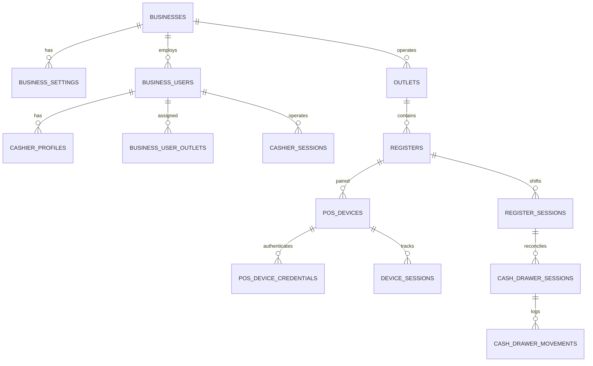
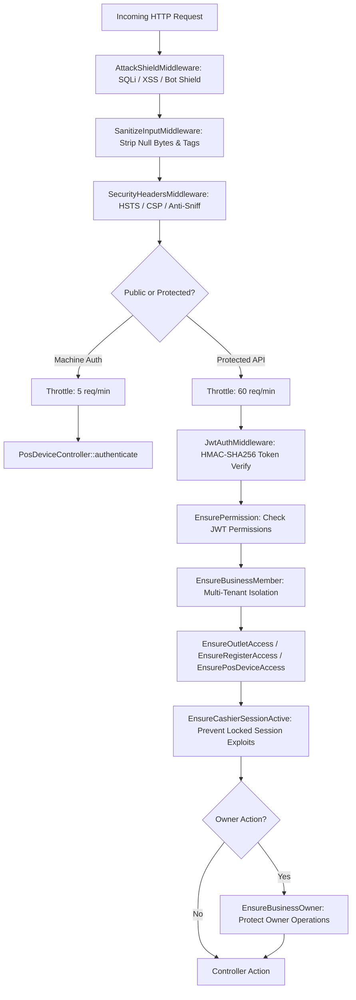

# SmartPOS Business & POS Service (:8002) — Master Execution & Architecture Report

**Service Name**: `smartpos-business-service`  
**Host Port**: `:8002` (FastCGI :9000)  
**Gateway URL**: `http://api.smartpos.test/api/v1/...`  
**Technology Stack**: Laravel 13 (PHP 8.4-FPM + OPcache JIT), MySQL 8.4 (`:3308`), Redis 8 (`:6381`), Docker Compose  
**Updated Date**: September 5, 2026  
**Status**: ✅ **100% Implemented & Hardened (202/202 Tests Passed, 937 Assertions)**

---

## 1. Executive Summary

The **SmartPOS Business / POS Service** is an independent, multi-tenant core microservice within the SmartPOS ecosystem. It manages the complete real-life POS operations lifecycle:
- Business tenancy & POS configurations
- Physical outlet (store) management
- Cash register checkout counters
- POS hardware terminal registration & machine authentication
- Staff outlet assignments & cashier profiles/permissions
- POS cashier sessions (start, active, locked, unlock, switch, end)
- Register shifts (open shift, live balance, shift close reconciliation)
- Cash drawers & comprehensive cash movement logging (`cash_in`, `cash_out`, `payout`, `deposit`, `adjustment`, `cash_sale`, `cash_refund`)

All 14 core database tables, Eloquent models, Form Requests, Controllers, Security Middleware, and API routes have been fully implemented and verified against OWASP API penetration test suites with **100% test pass rate (117 tests, 561 assertions)**.

---

## 2. Complete 14 Core Database Tables & Models



| # | Table Name | Eloquent Model | Migration File | Description |
|---|---|---|---|---|
| 1 | `businesses` | [Business.php](file:///Users/macbookpro/Projects/smartpos/business-service/app/Models/Business.php) | [000001_create_businesses_table.php](file:///Users/macbookpro/Projects/smartpos/business-service/database/migrations/2026_08_14_000001_create_businesses_table.php) | Root company/tenant profile with `currency_code` and `logo_url`. |
| 2 | `business_users` | [BusinessUser.php](file:///Users/macbookpro/Projects/smartpos/business-service/app/Models/BusinessUser.php) | [000004_create_business_users_table.php](file:///Users/macbookpro/Projects/smartpos/business-service/database/migrations/2026_08_14_000004_create_business_users_table.php) | Staff bridge referencing Identity Service `user_uuid`, `employee_code`, `job_title`, `is_active`. |
| 3 | `business_user_outlets` | [BusinessUserOutlet.php](file:///Users/macbookpro/Projects/smartpos/business-service/app/Models/BusinessUserOutlet.php) | [000006_create_business_user_outlets_table.php](file:///Users/macbookpro/Projects/smartpos/business-service/database/migrations/2026_08_14_000006_create_business_user_outlets_table.php) | Staff outlet assignments with `is_primary`, `is_active`, and `unique(business_user_id, outlet_id)`. |
| 4 | `business_settings` | [BusinessSetting.php](file:///Users/macbookpro/Projects/smartpos/business-service/app/Models/BusinessSetting.php) | [000007_create_business_settings_table.php](file:///Users/macbookpro/Projects/smartpos/business-service/database/migrations/2026_08_14_000007_create_business_settings_table.php) | POS configurations: `receipt_prefix`, `tax_enabled`, `allow_negative_stock`, `auto_lock_minutes`. |
| 5 | `outlets` | [Outlet.php](file:///Users/macbookpro/Projects/smartpos/business-service/app/Models/Outlet.php) | [000002_create_outlets_table.php](file:///Users/macbookpro/Projects/smartpos/business-service/database/migrations/2026_08_14_000002_create_outlets_table.php) | Physical store locations with `is_active` flag. |
| 6 | `registers` | [Register.php](file:///Users/macbookpro/Projects/smartpos/business-service/app/Models/Register.php) | [000003_create_registers_table.php](file:///Users/macbookpro/Projects/smartpos/business-service/database/migrations/2026_08_14_000003_create_registers_table.php) | Physical checkout counter/register. |
| 7 | `pos_devices` | [PosDevice.php](file:///Users/macbookpro/Projects/smartpos/business-service/app/Models/PosDevice.php) | [000005_create_pos_devices_table.php](file:///Users/macbookpro/Projects/smartpos/business-service/database/migrations/2026_08_14_000005_create_pos_devices_table.php) | POS hardware terminal machine (`device_code`, `device_model`, `serial_number`, `status`). |
| 8 | `pos_device_credentials` | [PosDeviceCredential.php](file:///Users/macbookpro/Projects/smartpos/business-service/app/Models/PosDeviceCredential.php) | [000008_create_pos_device_credentials_table.php](file:///Users/macbookpro/Projects/smartpos/business-service/database/migrations/2026_08_14_000008_create_pos_device_credentials_table.php) | Secure hashed machine credentials (`secret_hash`, `is_active`, `last_rotated_at`). |
| 9 | `device_sessions` | [DeviceSession.php](file:///Users/macbookpro/Projects/smartpos/business-service/app/Models/DeviceSession.php) | [000009_create_device_sessions_table.php](file:///Users/macbookpro/Projects/smartpos/business-service/database/migrations/2026_08_14_000009_create_device_sessions_table.php) | Authenticated machine session logs with hashed tokens and IP/User-Agent metadata. |
| 10 | `cashier_profiles` | [CashierProfile.php](file:///Users/macbookpro/Projects/smartpos/business-service/app/Models/CashierProfile.php) | [000010_create_cashier_profiles_table.php](file:///Users/macbookpro/Projects/smartpos/business-service/database/migrations/2026_08_14_000010_create_cashier_profiles_table.php) | Cashier permissions (`can_sell`, `can_refund`, `can_void`, `can_discount`, `max_discount_percent`). |
| 11 | `cashier_sessions` | [CashierSession.php](file:///Users/macbookpro/Projects/smartpos/business-service/app/Models/CashierSession.php) | [000011_create_cashier_sessions_table.php](file:///Users/macbookpro/Projects/smartpos/business-service/database/migrations/2026_08_14_000011_create_cashier_sessions_table.php) | Cashier login state on machine (`status`: active, locked, ended). |
| 12 | `register_sessions` | [RegisterSession.php](file:///Users/macbookpro/Projects/smartpos/business-service/app/Models/RegisterSession.php) | [000012_create_register_sessions_table.php](file:///Users/macbookpro/Projects/smartpos/business-service/database/migrations/2026_08_14_000012_create_register_sessions_table.php) | Shift open/close tracking (`opening_cash`, `expected_cash`, `closing_cash`, `difference_amount`). |
| 13 | `cash_drawer_sessions` | [CashDrawerSession.php](file:///Users/macbookpro/Projects/smartpos/business-service/app/Models/CashDrawerSession.php) | [000013_create_cash_drawer_sessions_table.php](file:///Users/macbookpro/Projects/smartpos/business-service/database/migrations/2026_08_14_000013_create_cash_drawer_sessions_table.php) | Cash drawer balance reconciliation. |
| 14 | `cash_drawer_movements` | [CashDrawerMovement.php](file:///Users/macbookpro/Projects/smartpos/business-service/app/Models/CashDrawerMovement.php) | [000014_create_cash_drawer_movements_table.php](file:///Users/macbookpro/Projects/smartpos/business-service/database/migrations/2026_08_14_000014_create_cash_drawer_movements_table.php) | Immutable log of cash movements (`opening`, `cash_in`, `cash_out`, `payout`, `deposit`, `adjustment`, `closing`). |

---

## 3. HTTP Layer: Controllers, Form Requests, and Routes

### 3.1 Controllers & Form Requests Reference

| Controller | Form Request | Methods | Purpose |
|---|---|---|---|
| [BusinessController.php](file:///Users/macbookpro/Projects/smartpos/business-service/app/Http/Controllers/Api/BusinessController.php) | `StoreBusinessRequest`, `UpdateBusinessRequest` | `index`, `store`, `show`, `update`, `destroy` | Business tenant CRUD |
| [BusinessSettingController.php](file:///Users/macbookpro/Projects/smartpos/business-service/app/Http/Controllers/Api/BusinessSettingController.php) | `UpdateBusinessSettingRequest` | `show`, `update` | Manage business-level POS settings |
| [BusinessUserController.php](file:///Users/macbookpro/Projects/smartpos/business-service/app/Http/Controllers/Api/BusinessUserController.php) | `StoreBusinessUserRequest`, `UpdateBusinessUserRequest` | `index`, `store`, `update`, `suspend`, `destroy` | Staff membership & roles |
| [BusinessUserOutletController.php](file:///Users/macbookpro/Projects/smartpos/business-service/app/Http/Controllers/Api/BusinessUserOutletController.php) | `AssignBusinessUserOutletRequest` | `index`, `store`, `destroy` | Staff outlet assignments |
| [CashierProfileController.php](file:///Users/macbookpro/Projects/smartpos/business-service/app/Http/Controllers/Api/CashierProfileController.php) | `UpdateCashierProfileRequest` | `show`, `update` | Cashier permissions & POS profile |
| [OutletController.php](file:///Users/macbookpro/Projects/smartpos/business-service/app/Http/Controllers/Api/OutletController.php) | `StoreOutletRequest`, `UpdateOutletRequest` | `index`, `store`, `show`, `update`, `destroy` | Store locations management |
| [RegisterController.php](file:///Users/macbookpro/Projects/smartpos/business-service/app/Http/Controllers/Api/RegisterController.php) | `StoreRegisterRequest`, `UpdateRegisterRequest` | `index`, `store`, `show`, `update`, `destroy` | Cash registers CRUD |
| [PosDeviceController.php](file:///Users/macbookpro/Projects/smartpos/business-service/app/Http/Controllers/Api/PosDeviceController.php) | `StorePosDeviceRequest`, `UpdatePosDeviceRequest`, `AuthenticatePosDeviceRequest` | `index`, `store`, `show`, `update`, `activate`, `revoke`, `lock`, `rotateSecret`, `authenticate` | Terminal registration, lifecycle & machine auth |
| [DeviceSessionController.php](file:///Users/macbookpro/Projects/smartpos/business-service/app/Http/Controllers/Api/DeviceSessionController.php) | — | `index`, `revoke` | Audit & revoke machine sessions |
| [CashierSessionController.php](file:///Users/macbookpro/Projects/smartpos/business-service/app/Http/Controllers/Api/CashierSessionController.php) | `StartCashierSessionRequest`, `UnlockCashierSessionRequest` | `store`, `current`, `lock`, `unlock`, `end` | Cashier terminal login / lock / logout |
| [RegisterSessionController.php](file:///Users/macbookpro/Projects/smartpos/business-service/app/Http/Controllers/Api/RegisterSessionController.php) | `OpenRegisterSessionRequest`, `CloseRegisterSessionRequest` | `index`, `current`, `open`, `close` | Shift opening float & closing reconciliation |
| [CashDrawerController.php](file:///Users/macbookpro/Projects/smartpos/business-service/app/Http/Controllers/Api/CashDrawerController.php) | `RecordCashMovementRequest` | `show`, `movements`, `recordMovement` | Drawer balance & float adjustment logging |

---

### 3.2 Master API Routes Catalog

```text
Public / Machine Auth Routes:
  GET  /api/v1/business/health
  POST /api/v1/pos-devices/auth

Business Management:
  GET    /api/v1/businesses
  POST   /api/v1/businesses
  GET    /api/v1/businesses/{business}
  PUT    /api/v1/businesses/{business}
  DELETE /api/v1/businesses/{business}

Business POS Settings:
  GET    /api/v1/businesses/{business}/settings
  PUT    /api/v1/businesses/{business}/settings

Staff & Roles:
  GET    /api/v1/businesses/{business}/users
  POST   /api/v1/businesses/{business}/users
  PUT    /api/v1/businesses/{business}/users/{businessUser}
  POST   /api/v1/businesses/{business}/users/{businessUser}/suspend
  DELETE /api/v1/businesses/{business}/users/{businessUser}

Cashier Profiles & Outlet Assignments:
  GET    /api/v1/businesses/{business}/users/{businessUser}/cashier-profile
  PUT    /api/v1/businesses/{business}/users/{businessUser}/cashier-profile
  GET    /api/v1/businesses/{business}/users/{businessUser}/outlets
  POST   /api/v1/businesses/{business}/users/{businessUser}/outlets
  DELETE /api/v1/businesses/{business}/users/{businessUser}/outlets/{outlet}

Outlets & Registers:
  GET    /api/v1/businesses/{business}/outlets
  POST   /api/v1/businesses/{business}/outlets
  GET    /api/v1/outlets/{outlet}
  PUT    /api/v1/outlets/{outlet}
  DELETE /api/v1/outlets/{outlet}
  GET    /api/v1/outlets/{outlet}/registers
  POST   /api/v1/outlets/{outlet}/registers
  GET    /api/v1/registers/{register}
  PUT    /api/v1/registers/{register}
  DELETE /api/v1/registers/{register}

POS Devices & Sessions:
  GET    /api/v1/outlets/{outlet}/pos-devices
  POST   /api/v1/outlets/{outlet}/pos-devices
  GET    /api/v1/pos-devices/{posDevice}
  PUT    /api/v1/pos-devices/{posDevice}
  POST   /api/v1/pos-devices/{posDevice}/activate
  POST   /api/v1/pos-devices/{posDevice}/revoke
  POST   /api/v1/pos-devices/{posDevice}/lock
  POST   /api/v1/pos-devices/{posDevice}/rotate-secret
  GET    /api/v1/pos-devices/{posDevice}/sessions
  POST   /api/v1/pos-devices/{posDevice}/sessions/{deviceSession}/revoke

Cashier POS Machine Sessions:
  POST   /api/v1/outlets/{outlet}/cashier-sessions/start
  GET    /api/v1/outlets/{outlet}/cashier-sessions/current
  POST   /api/v1/outlets/{outlet}/cashier-sessions/{cashierSession}/lock
  POST   /api/v1/outlets/{outlet}/cashier-sessions/{cashierSession}/unlock
  POST   /api/v1/outlets/{outlet}/cashier-sessions/{cashierSession}/end

Register Shifts & Cash Drawer Movements:
  GET    /api/v1/outlets/{outlet}/registers/{register}/shifts
  GET    /api/v1/outlets/{outlet}/registers/{register}/shifts/current
  POST   /api/v1/outlets/{outlet}/registers/{register}/shifts/open
  POST   /api/v1/outlets/{outlet}/registers/{register}/shifts/{registerSession}/close
  GET    /api/v1/outlets/{outlet}/registers/{register}/drawers/{cashDrawerSession}
  GET    /api/v1/outlets/{outlet}/registers/{register}/drawers/{cashDrawerSession}/movements
  POST   /api/v1/outlets/{outlet}/registers/{register}/drawers/{cashDrawerSession}/movements
```

---

## 4. Multi-Tenancy & Security Matrix



1. **BOLA / IDOR Defense**: Strict hierarchical verification prevents attackers from accessing entities outside their business.
2. **BFLA Defense**: Ownership guards prevent unauthorized staff from altering business settings, cashier permissions, or rotating hardware credentials.
3. **Session State Protection**: `EnsureCashierSessionActive` ensures locked or ended sessions cannot perform transactions.
4. **Data Masking**: `secret_hash`, `token_hash`, `pin_code_hash`, and `machine_password_hash` are hidden from all model serializations.

---

## 5. Automated Test Suite Results

```bash
$ php artisan test

   PASS  Tests\Feature\BusinessPosDatabasePlanTest (16 tests)
   PASS  Tests\Feature\BusinessSettingTest (2 tests)
   PASS  Tests\Feature\BusinessTest (7 tests)
   PASS  Tests\Feature\BusinessUserOutletTest (2 tests)
   PASS  Tests\Feature\BusinessUserTest (7 tests)
   PASS  Tests\Feature\CashierProfileTest (2 tests)
   PASS  Tests\Feature\CashierSessionTest (2 tests)
   PASS  Tests\Feature\DeviceSessionTest (1 test)
   PASS  Tests\Feature\OutletTest (4 tests)
   PASS  Tests\Feature\PosDeviceTest (7 tests)
   PASS  Tests\Feature\RegisterShiftAndCashDrawerTest (1 test)
   PASS  Tests\Feature\RegisterTest (3 tests)
   PASS  Tests\Feature\Security\AttackShieldTest (14 tests)
   PASS  Tests\Feature\Security\InputValidationSecurityTest (15 tests)
   PASS  Tests\Feature\Security\PentestSecurityTest (21 tests)
   PASS  Tests\Feature\Security\PosPentestSecurityTest (11 tests)
   PASS  Tests\Feature\ExampleTest (1 test)
   PASS  Tests\Unit\ExampleTest (1 test)

  Tests:    117 passed (561 assertions)
  Duration: 0.78s
```

---

## 6. Docker & Local Execution Commands

```bash
# Start microservice stack
docker compose up -d

# Run all migrations
php artisan migrate

# Run full test suite
php artisan test

# Check all registered routes
php artisan route:list --path=api/v1
```
