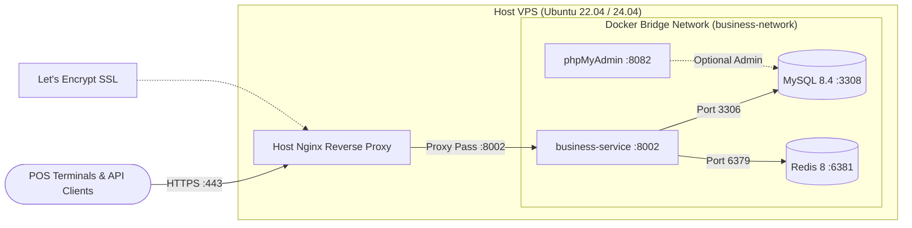

# SmartPOS Business Service (:8002) — VPS Production Deployment Guide

**Service**: `smartpos-business-service`  
**Internal Port**: `:8002` (mapped from container `:8000`)  
**MySQL Port**: `:3308` (internal Docker network `:3306`)  
**Redis Port**: `:6381` (internal Docker network `:6379`)  
**Target Environment**: Ubuntu 22.04 / 24.04 LTS (Hostinger, AWS, DigitalOcean, Hetzner)  
**Database**: MySQL 8.4 & Redis 8-alpine  

---

## 1. Architecture & Port Mapping



---

## 2. Server Prerequisites & DNS Configuration

### Minimum Server Specifications
- **CPU**: 2 vCPU cores (minimum)
- **RAM**: 4 GB RAM (8 GB recommended for combined microservices)
- **Disk**: 40 GB+ SSD NVMe
- **OS**: Ubuntu 22.04 LTS or Ubuntu 24.04 LTS

### DNS Configuration
Point your domain or subdomain DNS A-records to your VPS public IPv4:
```text
A   api.smartpos.yourdomain.com      -->  YOUR_VPS_IP
A   business.smartpos.yourdomain.com -->  YOUR_VPS_IP
```

---

## 3. Step-by-Step VPS Provisioning & Security Hardening

### Step 3.1: System Update & Package Installation
Connect via SSH as root and update the system:
```bash
sudo apt update && sudo apt upgrade -y
sudo apt install -y git curl wget ufw fail2ban htop unzip ca-certificates gnupg lsb-release
```

### Step 3.2: Configure UFW Firewall
Allow only SSH, HTTP, and HTTPS. **Never expose database ports (3308, 6381) to the public internet**:
```bash
sudo ufw default deny incoming
sudo ufw default allow outgoing
sudo ufw allow 22/tcp
sudo ufw allow 80/tcp
sudo ufw allow 443/tcp
sudo ufw enable
```

### Step 3.3: Install Docker Engine & Docker Compose V2
```bash
# Add Docker's official GPG key
sudo install -m 0755 -d /etc/apt/keyrings
sudo curl -fsSL https://download.docker.com/linux/ubuntu/gpg -o /etc/apt/keyrings/docker.asc
sudo chmod a+r /etc/apt/keyrings/docker.asc

# Add the Docker repository to Apt sources
echo \
  "deb [arch=$(dpkg --print-architecture) signed-by=/etc/apt/keyrings/docker.asc] https://download.docker.com/linux/ubuntu \
  $(. /etc/os-release && echo "$VERSION_CODENAME") stable" | \
  sudo tee /etc/apt/sources.list.d/docker.list > /dev/null

sudo apt update
sudo apt install -y docker-ce docker-ce-cli containerd.io docker-buildx-plugin docker-compose-plugin

# Enable and start Docker service
sudo systemctl enable docker
sudo systemctl start docker
```

---

## 4. Deploying SmartPOS Business Service

### Step 4.1: Clone the Codebase
```bash
sudo mkdir -p /var/www/smartpos
cd /var/www/smartpos
sudo git clone https://github.com/kheangsenghorng/smartpos_business-service.git business-service
cd business-service
```

### Step 4.2: Create Production `.env`
Create `.env` based on `.env.example`:
```bash
cp .env.example .env
nano .env
```

Set the production parameters:
```dotenv
APP_NAME=SmartPOS-BusinessService
APP_ENV=production
APP_DEBUG=false
APP_KEY=
APP_URL=https://api.smartpos.yourdomain.com

LOG_CHANNEL=stack
LOG_LEVEL=warning

# Database Configuration (Docker container internal hostname 'mysql')
DB_CONNECTION=mysql
DB_HOST=mysql
DB_PORT=3306
DB_DATABASE=smartpos_business_db
DB_USERNAME=smartpos_user
DB_PASSWORD=YourStrongDatabasePassword123!
MYSQL_ROOT_PASSWORD=YourStrongRootPassword123!

# Redis Configuration (Docker container internal hostname 'redis')
REDIS_CLIENT=phpredis
REDIS_HOST=redis
REDIS_PASSWORD=null
REDIS_PORT=6379

CACHE_STORE=redis
SESSION_DRIVER=redis
QUEUE_CONNECTION=redis

# Shared JWT Secret (Must match identity-service JWT_SECRET exactly)
JWT_SECRET=YourSuperSecure64CharHMACSHA256SecretKeyStringHere!
JWT_ALGO=HS256
JWT_ISSUER=smartpos-auth-service
JWT_AUDIENCE=smartpos-api

# CORS Settings
CORS_ALLOWED_ORIGINS=https://pos.smartpos.yourdomain.com,https://admin.smartpos.yourdomain.com
```

### Step 4.3: Build & Launch Docker Containers
```bash
# Build images and launch in detached mode
docker compose up -d --build

# Verify all containers are running and healthy
docker compose ps
```

### Step 4.4: Initialize Application Keys & Migrations
```bash
# Generate APP_KEY
docker compose exec business-service php artisan key:generate

# Run database migrations
docker compose exec business-service php artisan migrate --force

# Optimize Laravel configurations and routes for production
docker compose exec business-service php artisan config:cache
docker compose exec business-service php artisan route:cache
docker compose exec business-service php artisan view:cache
```

---

## 5. Host Nginx Reverse Proxy & SSL (Let's Encrypt)

### Step 5.1: Install Nginx & Certbot
```bash
sudo apt install -y nginx certbot python3-certbot-nginx
```

### Step 5.2: Configure Nginx Server Block
Create `/etc/nginx/sites-available/business-service.conf`:
```bash
sudo nano /etc/nginx/sites-available/business-service.conf
```

Paste the following configuration:
```nginx
server {
    listen 80;
    server_name api.smartpos.yourdomain.com;

    # SEC-03 FIX: Aligned with SanitizeInputMiddleware's 2 MB app-level limit.
    # Prevents bandwidth consumption before PHP rejects oversized payloads.
    client_max_body_size 2M;

    location / {
        proxy_pass http://127.0.0.1:8002;
        proxy_http_version 1.1;

        proxy_set_header Host $host;
        proxy_set_header X-Real-IP $remote_addr;
        proxy_set_header X-Forwarded-For $proxy_add_x_forwarded_for;
        proxy_set_header X-Forwarded-Proto $scheme;
        proxy_set_header X-Forwarded-Port $server_port;
        proxy_set_header Upgrade $http_upgrade;
        proxy_set_header Connection 'upgrade';

        proxy_connect_timeout 60s;
        proxy_send_timeout 60s;
        proxy_read_timeout 60s;
    }
}
```

Enable the configuration:
```bash
sudo ln -s /etc/nginx/sites-available/business-service.conf /etc/nginx/sites-enabled/
sudo nginx -t
sudo systemctl reload nginx
```

### Step 5.3: Obtain Free SSL Certificate via Certbot
```bash
sudo certbot --nginx -d api.smartpos.yourdomain.com --non-interactive --agree-tos -m admin@yourdomain.com
```

Certbot will automatically configure HTTPS, HTTP $\to$ HTTPS redirection, and automatic renewal timers.

---

## 6. Verification & Health Checks

Test the live deployed service:
```bash
# 1. Microservice Health Check
curl -i https://api.smartpos.yourdomain.com/api/v1/business/health

# Expected Response (HTTP 200 OK):
# {"status":"ok","service":"smartpos-business-service","version":"1.0.0","timestamp":"..."}

# 2. Test Container Logs
docker compose logs -f business-service
```

---

## 7. CI/CD Automated Deployment (GitHub Actions)

Add the following GitHub Actions workflow in `.github/workflows/deploy.yml` on GitHub:

```yaml
name: Deploy to Production VPS

on:
  push:
    branches: [ main ]

jobs:
  deploy:
    name: Deploy Business Service
    runs-on: ubuntu-latest

    steps:
      - name: Deploy via SSH
        uses: appleboy/ssh-action@v1.0.3
        with:
          host: ${{ secrets.VPS_HOST }}
          username: ${{ secrets.VPS_USERNAME }}
          key: ${{ secrets.VPS_SSH_PRIVATE_KEY }}
          port: ${{ secrets.VPS_SSH_PORT || 22 }}
          script: |
            cd /var/www/smartpos/business-service
            git pull origin main
            docker compose up -d --build
            docker compose exec -T business-service php artisan migrate --force
            docker compose exec -T business-service php artisan config:cache
            docker compose exec -T business-service php artisan route:cache
            echo "Deployment completed successfully!"
```

---

## 8. Maintenance, Backups & Operations

### Database Backup Script
Create a daily backup cron job at `/root/backup-business-db.sh`:
```bash
#!/bin/bash
BACKUP_DIR="/var/backups/smartpos/business"
mkdir -p "$BACKUP_DIR"
TIMESTAMP=$(date +"%Y%m%d_%H%M%S")
docker compose -f /var/www/smartpos/business-service/docker-compose.yml exec -T business-mysql mysqldump -u root -pYourStrongRootPassword123! smartpos_business_db | gzip > "$BACKUP_DIR/smartpos_business_$TIMESTAMP.sql.gz"

# Keep last 14 days of backups
find "$BACKUP_DIR" -type f -name "*.sql.gz" -mtime +14 -delete
```

Make executable and add to crontab:
```bash
chmod +x /root/backup-business-db.sh
(crontab -l 2>/dev/null; echo "0 2 * * * /root/backup-business-db.sh") | crontab -
```

### Useful Maintenance Commands
```bash
# View live application logs
docker compose logs -f --tail=100 business-service

# Restart all services
docker compose restart

# Access MySQL shell directly
docker compose exec business-mysql mysql -u root -p

# Access container bash terminal
docker compose exec business-service bash
```
